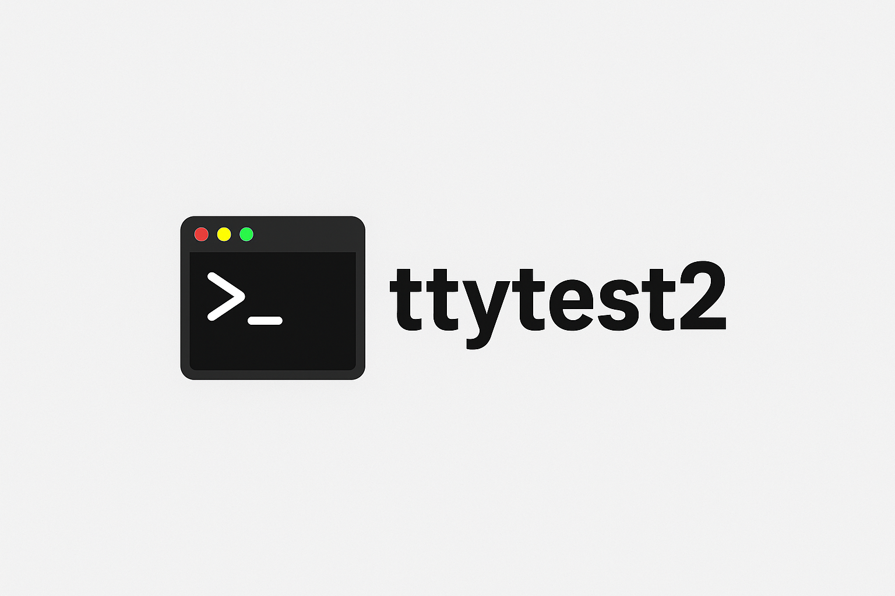

# ttytest2

<a href="https://rubygems.org/gems/ttytest2">

</a>

ttytest2 is a integration test framework for CLI & shell applications.

ttytest2 is a fork and a drop-in replacement for [ttytest](https://github.com/jhawthorn/ttytest).

It works by creating a tmux session behind the scenes, running the specified commands, capturing the pane, and then comparing the actual content to the expected content based on the assertions made.

The assertions will wait a specified amount of time (configurable, default 2 seconds) for the expected content to appear.

[](https://badge.fury.io/rb/ttytest2)

## Table of Contents

1. [Minimum Requirements](#minimum-requirements)
2. [Usage](#usage)
3. [Initializing](#initializing)
4. [Assertions](#assertions)
5. [Output](#output)
6. [Configurables](#configurables)
7. [Troubleshooting](#troubleshooting)
8. [Tips](#tips)
9. [Docker](#docker)
10. [Contributing](#contributing)
11. [License](#license)

## Minimum Requirements

* tmux >= 1.8
* Ruby >= 3.2.3

## Usage

* Download the [gem](https://rubygems.org/gems/ttytest2) here.
* More documentation available at [ttytest2 docs](https://www.rubydoc.info/gems/ttytest2).
* There are more examples in the examples folder.
* Synchronous example: [ncsh synchronous tests](https://github.com/a-eski/ncsh/blob/main/acceptance_tests/tests/acceptance_tests.rb)
* Concurrent & generated example: [ncsh concurrent tests](https://github.com/a-eski/ncsh/blob/main/acceptance_tests/minitest/tests.rb)

### Simple Example

``` ruby
require 'ttytest'

@tty = TTYtest.new_terminal(%(PS1='$ ' /bin/sh), width: 80, height: 7)
@tty.assert_row(0, '$')
@tty.assert_cursor_position(2, 0)

@tty.send_line('echo "Hello, world"'))

@tty.assert_contents <<~TTY
  $ echo "Hello, world"
  Hello, world
  $
TTY
@tty.assert_cursor_position(2, 2)

@tty.assert_contents_at(0, 0, '$ echo "Hello, world"')

@tty.assert_row_starts_with(0, '$ echo')
@tty.assert_row_ends_with(0, '"Hello, world"')
@tty.assert_row_starts_with(1, 'Hello')
@tty.assert_row_ends_with(1, ', world')

@tty.print_rows # prints out the contents of the terminal as an array:
# ["$ echo \"Hello, world\"", "Hello, world", "$", "", "", "", ""]

@tty.print # prints out the contents of the terminal:
# $ echo "Hello, world"
# Hello, world
# $
```

## Initializing

Call one of these methods to initialize an instance of ttytest2.

* `new_terminal(cmd, width, height, max_wait_time, use_return_for_newline)`: initialize new tmux terminal instance and run cmd.

* `new_default_sh_terminal()`: intialize new tmux terminal instance using sh, width of 80, height of 24.

* `new_sh_terminal(width, height, max_wait_time, use_return_for_newline)`: intialize new tmux terminal instance using sh with specified params.

``` ruby
require 'ttytest'

# these are all equivalent
@tty = TTYtest.new_terminal(%(PS1='$ ' /bin/sh))
@tty = TTYtest.new_terminal(%(PS1='$ ' /bin/sh), width: 80, height: 24)
@tty = TTYtest.new_default_sh_terminal
@tty = TTYtest.new_sh_terminal
@tty = TTYtest.new_sh_terminal(width: 80, height: 24)

# you can also use other shells, like bash
@tty = TTYtest.new_terminal('/bin/bash')
@tty = TTYtest.new_terminal('/bin/bash', width: 80, height: 24)

# you can specify further options, see section Configurables.
```

## Assertions

The main way to use ttytest2 is through assertions.

Assertions will be retried for up to 2 seconds when called through TTYtest::Terminal, unless you specify otherwise (see [Configurables](#configurables)).

### Aliases

Some assertions have aliases, like `assert_matches_at` has the alias `assert_rows`.

If you are reading this on github, the ruby docs accessible from [RubyDoc.Info](https://www.rubydoc.info/gems/ttytest2/) document all of the aliases.

### Available Assertions

* `assert_row(row_number, expected_text)`

* `assert_row_is_empty(row_number)`

* `assert_row_at(row_number, column_start_position, column_end_position, expected_text)`

* `assert_row_like(row_number, expected_text)`

* `assert_row_starts_with(row_number, expected_text)`

* `assert_row_ends_with(row_number, expected_text)`

* `assert_row_regexp(row_number, regexp_str)`

* `assert_rows_each_match_regexp(row_start, row_end, regexp_str)`

* `assert_column(col_number, expected_text)`

* `assert_column_is_empty(col_number)`

* `assert_column_at(col_number, row_start, row_end, expected_str)`

* `assert_cursor_position(x: x, y: y)`

* `assert_cursor_visible`

* `assert_cursor_hidden`

* `assert_contents(lines_of_terminal)`

* `assert_contents_at(row_start, row_end, expected_text)`

* `assert_contents_include(expected)`

* `assert_contents_empty`

* `assert_contents_match_regexp(regexp_str)`

* `assert_file_exists(file_path)`

* `assert_file_doesnt_exist(file_path)`

* `assert_file_contains(file_path, needle)`

* `assert_file_has_permissions(file_path, permissions)`

* `assert_file_has_line_count(file_path, expected_count)`

## Output

You can send output to the terminal with the following calls.

Note: Most of the time send_line has the best ergonomics.

### Base Functions

These functions form the basis of interacting with the tmux pane. They power all other functions, but you can use them directly when needed.

* `send_keys(output)`: for canonical shells/CLI's (or multi-character keys for noncanonical shells/CLI's).

* `send_keys_one_at_a_time(output)`: for noncanonical shells/CLI's.

* `send_keys_exact(output)`: sends keys as is, exactly. Also useful for sending tmux specific keys (any supported tmux send-keys arguments like: DC for delete, Escape for ESC, etc.)

### Ergonomic Functions

The base functions work great, but these functions build upon the base functions to provide more functionality and better ergonomics in most cases.

For example, `send_line(line)` makes sure that the enter key (newline character) is sent after the `line` so you don't have to worry about adding it to `line` or calling send_newline after.

* `send_line(line)`: simulate typing in a command in the terminal and hitting enter!

* `send_line_then_sleep(line, sleep_time)`: simulate typing in a command in the terminal and hitting enter, then wait for sleep_time seconds.

* `send_lines(lines)`: for each line in lines, simulate sending the line and hitting enter.

* `send_lines_then_sleep(lines, sleep_time)`: for each line in lines, simulate sending the line and hitting enter. After sending all the lines, sleep for sleep_time.

* `send_line_then_sleep_and_repeat(lines, sleep_time)`: for each line in lines, simulate sending the line and hitting enter, then sleep before sending the next line.

* `send_line_exact`: send line exactly as is to tmux. Certain special characters may not work with send_line. You can also include tmux send-keys arguments like DC for delete, etc.

* `send_line_exact_then_sleep(line, sleep_time)`: simulate typing in a command in the terminal and hitting enter using send_line_exact semantics, then wait for sleep_time seconds.

* `send_lines_exact`: send lines exactly are they are to tmux. Similar semantics to send_line_exact.

* `send_lines_exact_then_sleep(lines, sleep_time)`: for each line in lines, simulate sending the line and hitting enter using send_line_exact semantics. After sending all the lines, sleep for sleep_time.

* `send_line_exact_then_sleep_and_repeat(lines, sleep_time)`: for each line in lines, simulate sending the line and hitting enter using send_line_exact, then sleep before sending the next line.

### Output Helpers

Helper functions to make sending output easier! They use the methods above under 'Sending Output' section under the hood.

* `send_newline` # simulate hitting enter, equivalent to @tty.send_keys(%(\n))
* `send_newlines(number_of_times)` # equivalent to calling send_newline number_of_times

* `send_return` # simulate hitting enter, equivalent to @tty.send_keys(%(\r))
* `send_returns(number_of_times)` # equivalent to calling send_return number_of_times

* `send_backspace` # simulate hitting backspace, equivalent to @tty.send_keys(TTYtest::BACKSPACE)
* `send_backspaces(number_of_times)` # equivalent to calling send_backspace number_of_times

* `send_delete` # simulate hitting delete, equivalent to calling send_keys_exact(%(DC))
* `send_deletes(number_of_times)` # equivalent to calling send_delete number_of_times

* `send_right_arrow`
* `send_right_arrows(number_of_times)`

* `send_left_arrow`
* `send_left_arrows(number_of_times)`

* `send_up_arrow`
* `send_up_arrows(number_of_times)`

* `send_down_arrow`
* `send_down_arrows(number_of_times)`

* `send_home` # simulate pressing the Home key
* `send_end` # simulate pressing the End key

* `send_clear` # clear the screen by sending clear ascii code

* `send_escape`
* `send_escapes(number_of_times)`

* `send_tab`
* `send_tab(number_of_times)`

### F keys?

Send F keys like F1, F2, etc. as shown below:

``` ruby
@tty = TTYtest.new_terminal(%{PS1='$ ' /bin/sh}, width: 80, height: 24)

@tty.send_keys_exact(%(F1))
@tty.send_keys_exact(%(F2))
# ...
@tty.send_keys_exact('F11')
@tty.send_keys_exact('F12')
```

### Constants

There are some commonly used keys available as constants to make interacting with your application easier.

``` ruby
  TTYtest::CTRLA
  TTYtest::CTRLB
  TTYtest::CTRLC
  TTYtest::CTRLD
  TTYtest::CTRLF
  TTYtest::BELL # ring the terminal bell
  TTYtest::BACKSPACE
  TTYtest::TAB
  TTYtest::NEWLINE # \n
  TTYtest::ENTER # \n
  TTYtest::VERTICAL_TAB # \v
  TTYtest::SHIFT_ENTER # \v
  TTYtest::FORM_FEED # \f or New Page NP
  TTYtest::CTRLL
  TTYtest::RETURN # \r
  TTYtest::CTRLU
  TTYtest::CTRLW
  TTYtest::ESCAPE # 27 decimal or ^[ or /033
  TTYtest::CTRL_
  TTYtest::DELETE

  TTYtest::UP_ARROW
  TTYtest::DOWN_ARROW
  TTYtest::RIGHT_ARROW
  TTYtest::LEFT_ARROW

  TTYtest::HOME_KEY
  TTYtest::END_KEY

  TTYtest::CLEAR # clear the screen
```

## Configurables

There are 2 main configurations for ttytest2: max_wait_time, and use_return_for_newline.

### Max wait time

Max wait time represents the amount of time in seconds that ttytest2 will keep retrying an assertion before failing that assertion.

You can configure max wait time as shown below.

``` ruby
@tty = TTYtest::new_terminal('', max_wait_time: 1) # sets the max wait time to 1 second

@tty.assert_row(0, 'echo Hello, world') # this assertion would fail after 1 second
@tty.max_wait_time = 3
@tty.assert_row(0, 'echo Hello, world') # this assertion would fail after 3 seconds
```

### Use return for newline

Use return for newline tells ttytest2 to use return ('/r') instead of newline ('/n') for methods like send_line, send_line_exact, etc.

Some line readers may interpreter return and newline differently, so this can be useful in those cases.

You can still send newline via send_newline when this is enabled.

You can also send return by itself with send_return.

``` ruby
@tty = TTYtest::new_terminal('', use_return_for_newline: true) # specified to use return in place of newline

@tty.send_line('hello, world!') # will have return sent after 'hello, world!'
@tty.use_return_for_newline = false
@tty.assert_row(0, 'echo Hello, world') # will have newline sent after 'echo Hello, world'
```

## Troubleshooting

You can use the method rows to get all rows of the terminal as an array, of use the method capture to get the contents of the terminal window. This can be useful when troubleshooting.

``` ruby
@tty = TTYtest.new_terminal(%(PS1='$ ' /bin/sh), width: 80, height: 7)
@tty.send_line('echo "Hello, world"'))

# If you want to print the current terminal rows as an array of lines, you can use @tty.print_rows.
@tty.print_rows # prints out the contents of the terminal as an array:
# ["$ echo \"Hello, world\"", "Hello, world", "$", "", "", "", ""]

# you can use @tty.rows to access the entire pane, split by line into an array.
# if you want to programatically access the rows, you can do so using @tty.rows.
p @tty.rows # this is equivalent to above statement @tty.print_rows.

# If you want to print the current terminal contents, you can use @tty.print.
@tty.print # prints out the contents of the terminal:
# $ echo "Hello, world"
# Hello, world
# $

# you can use @tty.capture to access the entire pane.
# if you want to programatically access the entire pane, you can do so using @tty.capture.
p "\n#{@tty.capture}" # this is equivalent to above statement @tty.print
```

## Tips

If you are using ttyest2 to test your CLI, using sh can be easier than bash because you don't have to worry about user, current working directory, etc. as shown in the examples.

The assertions like `assert_row_like`, `assert_row_starts_with`, and `assert_row_ends_with` are usually extremely helpful, especially if trying to test your application in different environments or using a docker container with a shell that is not sh.

Most line readers use '\n' for newline, but some may interpret newline and return differently or expect '\r' for the enter key.

## Docker

Easy to use from Docker. Add this to your dockerfile to get started.

``` dockerfile
RUN apt update && \
  apt install gcc make ruby tmux -y && \
  gem install ttytest2

# add this if you have issues
# ENV RUBYOPT="-KU -E utf-8:utf-8"
```

## Contributing

Bug reports and pull requests are welcome on GitHub at [ttytest2](https://github.com/a-eski/ttytest2).

## License

The gem is available as open source under the terms of the [MIT License](http://opensource.org/licenses/MIT).
